# Hand Signal Translator

Real-time hand sign detection and translation using OpenCV, MediaPipe, and NumPy.

This project is designed to be beginner-friendly but production-usable for demos:
- tracks up to 2 hands
- draws landmarks and bounding boxes
- predicts gestures with smoothing
- supports optional speech and logging

## Quick Navigation

- [Features](#features)
- [Gesture Gallery](#gesture-gallery)
- [Project Structure](#project-structure)
- [Setup](#setup)
- [Run](#run)
- [Controls](#controls)
- [How It Works](#how-it-works)
- [Troubleshooting](#troubleshooting)

## Features

- Real-time webcam processing
- MediaPipe hand landmark tracking
- Multi-hand support (up to 2 hands)
- Left/right handedness correction for mirrored webcam view
- Rule-based gesture classifier with per-hand smoothing
- Optional text-to-speech (`--speak`)
- Optional logging to `gesture_log.txt` (`--log`)
- Reliable exit options (`q`, `x`, `Esc`, window close, `Ctrl+C`)

## Gesture Gallery

Combined reference sheet:

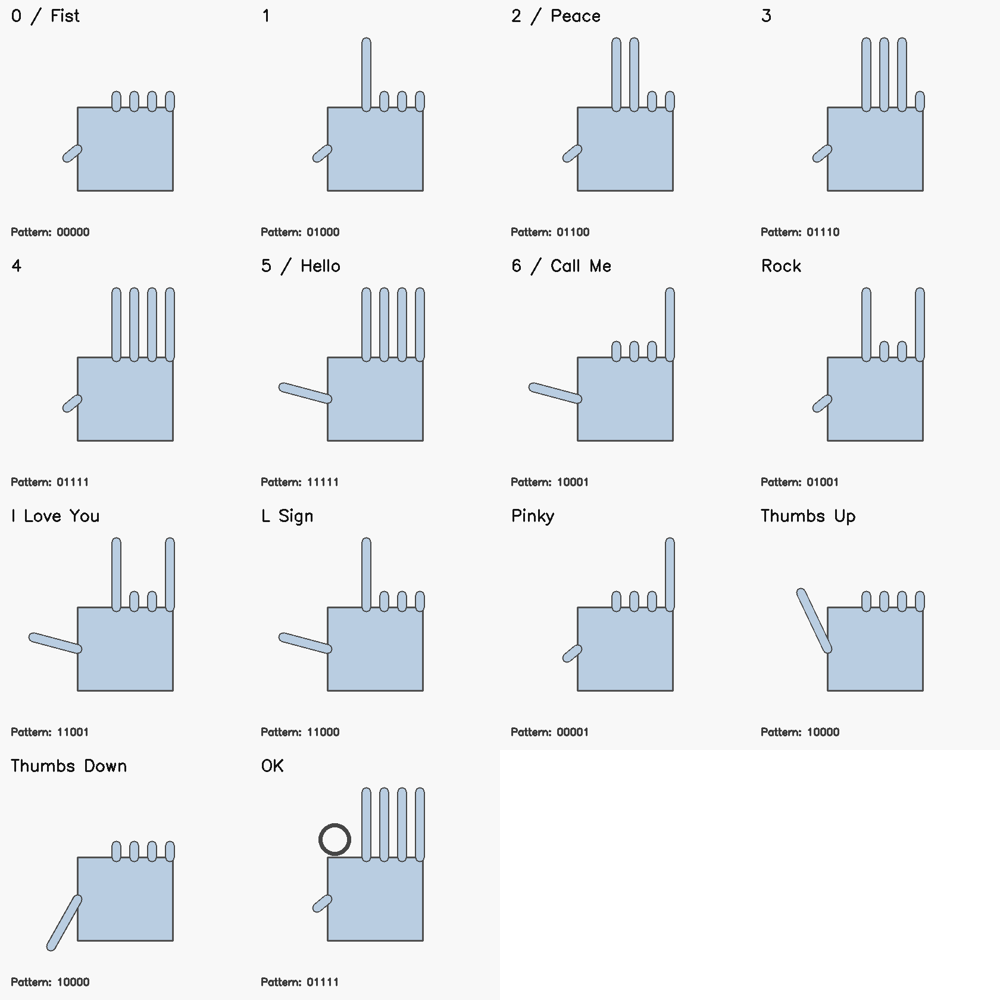

<details>
<summary><strong>Open Individual Gesture Images</strong></summary>

| Gesture | Image |
|---|---|
| `0 / Fist` | 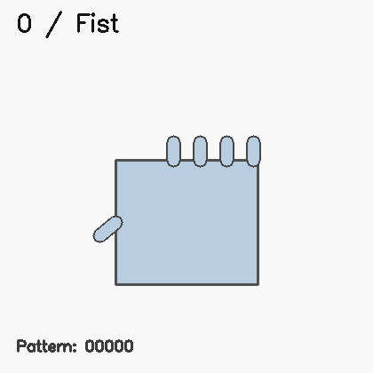 |
| `1` | 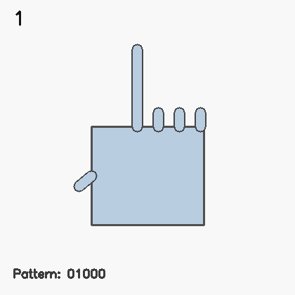 |
| `2 / Peace` | 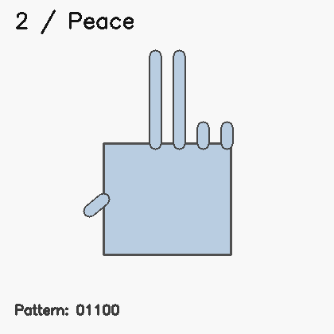 |
| `3` | 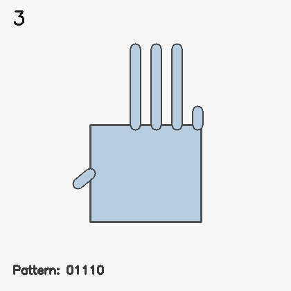 |
| `4` | 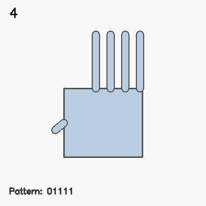 |
| `5 / Hello` | 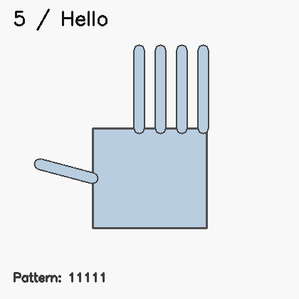 |
| `6 / Call Me` | 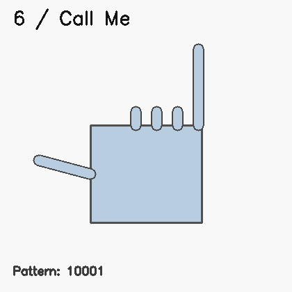 |
| `Rock` | 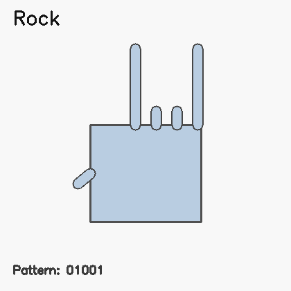 |
| `I Love You` | 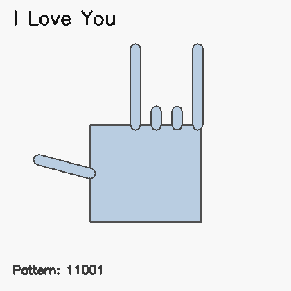 |
| `L Sign` | 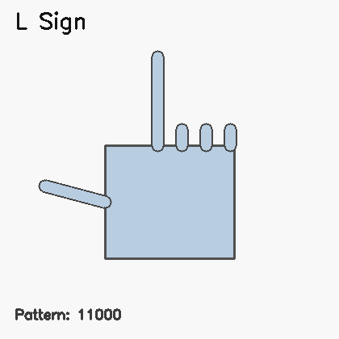 |
| `Pinky` | 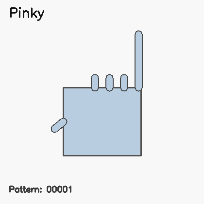 |
| `Thumbs Up` | 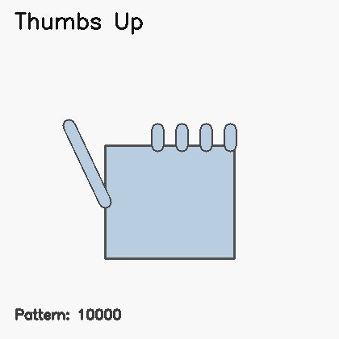 |
| `Thumbs Down` | 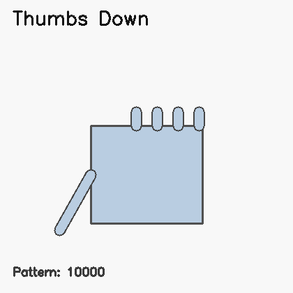 |
| `OK` | 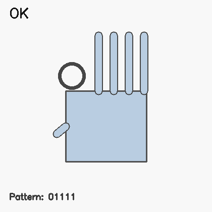 |

</details>

Reference images are lightweight illustrations to help understand each expected finger pattern.

## Project Structure

```text
hand sign/
|-- app.py
|-- requirements.txt
|-- .gitignore
|-- README.md
|-- models/
|   `-- hand_landmarker.task
|-- docs/
|   `-- gesture_images/
|       |-- gesture_reference_sheet.png
|       `-- ... gesture images ...
`-- src/
    |-- hand_detector.py
    |-- gesture_recognizer.py
    `-- utils.py
```

## Setup

1. Create a virtual environment:

```powershell
python -m venv .venv
```

2. Activate it:

```powershell
.venv\Scripts\Activate.ps1
```

3. Install dependencies:

```powershell
pip install -r requirements.txt
```

## Run

Basic run:

```powershell
python app.py
```

Common modes:

```powershell
python app.py --max-hands 1
python app.py --log
python app.py --speak
python app.py --no-swap-handedness
```

## Controls

- `q` quit
- `x` emergency quit
- `Esc` quit
- Close window button quits
- `Ctrl+C` in terminal quits

## Supported Gestures

- `0 / Fist`
- `1`
- `2 / Peace`
- `3`
- `4`
- `5 / Hello`
- `6 / Call Me`
- `Rock`
- `I Love You`
- `L Sign`
- `Pinky`
- `Thumbs Up`
- `Thumbs Down`
- `Thumb`
- `OK`

## How It Works

1. Capture webcam frame (`OpenCV`).
2. Detect hand landmarks (`MediaPipe`).
3. Estimate finger states using:
- joint angles
- wrist/palm-relative distances
- handedness-aware thumb logic
4. Convert finger states to a binary pattern.
5. Match to gesture map + special rules (`OK`, `Thumbs Up/Down`).
6. Smooth predictions per hand using short history.
7. Render overlays and optional logging/speech output.

## Troubleshooting

<details>
<summary><strong>Window does not close</strong></summary>

Try in this order:

1. Click the OpenCV window and press `x`
2. Press `Esc`
3. Press `q`
4. Press `Ctrl+C` in terminal
5. Force-stop Python:

```powershell
Get-Process python | Stop-Process
```

</details>

<details>
<summary><strong>Left/right labels are reversed</strong></summary>

Default mode swaps handedness for mirrored selfie view.

Use raw MediaPipe labels:

```powershell
python app.py --no-swap-handedness
```

</details>

<details>
<summary><strong>Gesture accuracy is low</strong></summary>

- Use brighter lighting
- Keep full hand inside frame
- Separate fingers clearly
- Keep hand roughly 40-80 cm from camera
- Hold gesture steady for 0.5 to 1 second

</details>
